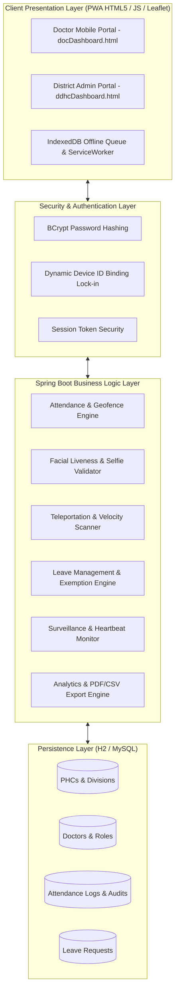
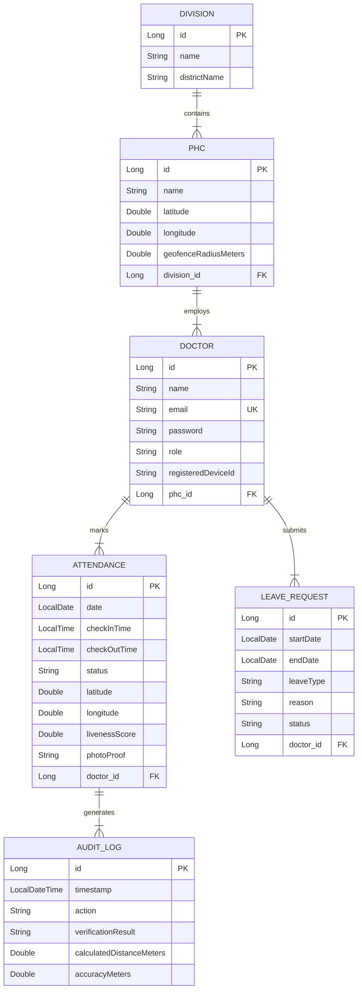
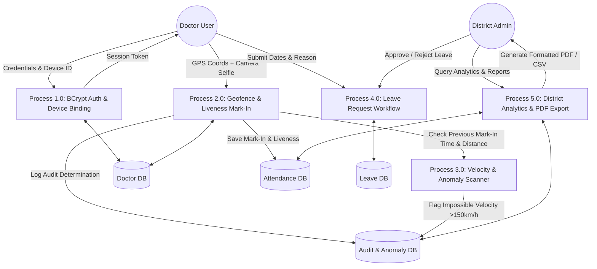

# ACADEMIC PROJECT REPORT & SYSTEM ARCHITECTURE
## Enterprise Primary Health Centre (PHC) Doctor Attendance & Health Surveillance System

---

### 📋 Project Abstract
The **PHC Doctor Attendance & Health Surveillance System** is an enterprise-grade, multi-tenant digital health governance platform designed to ensure medical officer presence across rural Primary Health Centres (PHCs). The platform combines real-time **Leaflet.js GPS Geofencing (500m radius)**, **Facial Liveness Selfie Verification**, **Velocity Spoof Scanners**, **PWA Offline IndexedDB Queueing**, **Chart.js Executive Dashboard Analytics**, **jsPDF Official Report Exports**, and **Emergency Epidemic SOS Duty Broadcasting**.

---

### 1. 📐 System Architecture Diagram



---

### 2. 🗄️ Entity-Relationship Diagram (ERD)



---

### 3. 🔄 Data Flow Diagram (DFD Level 1)



---

### 4. 🎭 UML Use Case Diagram

```mermaid
usecaseDiagram
    actor Doctor
    actor "District Admin (DDHS)" as Admin

    package "PHC Doctor Attendance & Health Surveillance System" {
        usecase "Authenticate & Bind Device" as UC1
        usecase "Mark Geofenced Attendance (Leaflet GPS)" as UC2
        usecase "Capture Facial Liveness Selfie" as UC3
        usecase "Continuous Presence Heartbeat Ping" as UC4
        usecase "Apply for Leave Exemption" as UC5
        usecase "View Real-Time Surveillance Feed" as UC6
        usecase "Inspect AI Anomaly & Velocity Audit Log" as UC7
        usecase "Approve / Reject Leave Requests" as UC8
        usecase "Export Official PDF & CSV Reports" as UC9
        usecase "Broadcast Emergency Outbreak SOS" as UC10
    }

    Doctor --> UC1
    Doctor --> UC2
    Doctor --> UC3
    Doctor --> UC4
    Doctor --> UC5

    Admin --> UC1
    Admin --> UC6
    Admin --> UC7
    Admin --> UC8
    Admin --> UC9
    Admin --> UC10
```

---

### 5. 🌟 Summary of Enterprise Features for Presentation

1. **Geofencing Engine**: Enforces strict physical presence within a configurable radius (default 500m) around designated PHCs using Leaflet.js and Haversine formula.
2. **Facial Liveness Verification**: Webcam selfie capture evaluating liveness score ($\ge 0.95$) to prevent photo-of-photo spoofing.
3. **Teleportation / Velocity Scanner**: Flags impossible physical movements (>150 km/h) between consecutive mark-ins across PHCs.
4. **BCrypt Security & Dynamic Device Binding**: Hashes passwords with BCrypt and locks logins to registered device IDs.
5. **PWA Offline ServiceWorker & IndexedDB Queue**: Permits attendance mark-in without internet connection, auto-syncing upon reconnection.
6. **Executive Chart.js Analytics**: Visual 7-day trend line charts and PHC compliance bar charts on DDHS Admin Dashboard.
7. **jsPDF Official Report Engine**: 1-click generation of formatted PDF and CSV audit reports complete with Government Directorate headers.
8. **AI Compliance Trust Scorecard**: Dynamic 0–100% security trust score computation displayed on doctor profiles.
9. **Emergency SOS Duty Broadcast**: One-click epidemic outbreak alert broadcast mode for district health officials.
