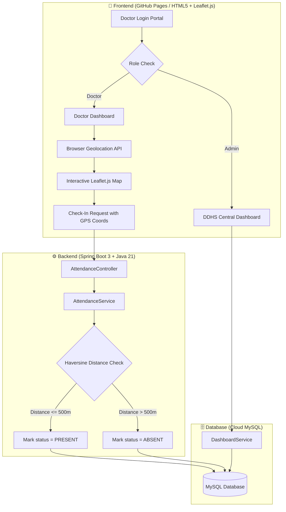

# 🏥 Primary Health Centre (PHC) Doctor Attendance & Geo-Fencing System

[](LICENSE)
[](https://openjdk.org/projects/jdk/21/)
[](https://spring.io/projects/spring-boot)
[](frontend/)
[](DEPLOYMENT.md)

A modern, full-stack, geo-fenced web application designed for central medical administration and real-time doctor attendance monitoring across Primary Health Centres (PHCs).

---

## 🌐 Live Demo & Deployment Links

| Layer | Platform | Live URL |
| :--- | :--- | :--- |
| **Frontend Web App** | GitHub Pages | [https://ranjithbrs.github.io/phc-doctor-attendance-system/](https://ranjithbrs.github.io/phc-doctor-attendance-system/) |
| **Backend REST API** | Render (Docker) | `https://phc-doctor-attendance-system.onrender.com` |
| **Database** | Railway Cloud | Cloud Managed MySQL Instance (`phc_db`) |

---

## 🔑 Demo Test Credentials

Test both role-based workflows using the following pre-seeded accounts:

### 1. 👨‍⚕️ Doctor Account
* **Email:** `doctor@phc.gov.in`
* **Password:** `doc123`
* **Features:** Live GPS Location & 500m Geo-Fence Map, Geo-fenced Check-In / Check-Out, Attendance Log History.

### 2. 🏛️ Admin / DDHS Dashboard Account
* **Email:** `admin@phc.gov.in`
* **Password:** `admin123`
* **Features:** District Health Surveillance Overview, Real-time Attendance % per PHC, Total Doctors vs Present Summary Cards.

*Alternatively, click **"Create Account"** on the sign-in page to register a custom Doctor or Admin account!*

---

## 📐 System Architecture & Workflow



---

## ✨ Key Features & Capabilities

- 📍 **Geo-Fenced Check-In**: Uses the **Haversine formula** to accurately calculate mathematical distance between live doctor GPS coordinates and the assigned PHC building location.
- ⭕ **500-Meter Geo-Fence Radius**: Automatically marks attendance as `PRESENT` if within 500m; marks as `ABSENT` with distance feedback if outside range.
- 🛑 **Strict Check-Out Protection**: Prevents overwriting `ABSENT` status during check-out and restricts check-out to active `PRESENT` sessions.
- 🗺️ **Interactive Leaflet.js Maps**: Displays doctor's real-time position alongside a visual 500m radius circle around the health centre.
- 🔐 **Role-Based Authentication**: Custom sign-in and registration flows for Doctors (`DOCTOR`) and Health Administrators (`ADMIN`).
- 📊 **Central DDHS Monitoring Dashboard**: District-wide analytics including Total PHCs, Total Doctors, Present/Absent statistics, and real-time attendance percentages per PHC.
- 📅 **Date-Filtered Attendance History**: Filterable personal attendance logs with check-in/check-out timestamps and dynamic status badges.
- 🎨 **Modern Responsive UI**: Built with pure CSS variables, glassmorphism card overlays, smooth micro-animations, and full mobile responsiveness.

---

## 🛠️ Technology Stack

### Frontend
- **Core:** HTML5, Vanilla JavaScript (ES6+)
- **Styling:** Custom CSS3 Design Tokens (Variables, Glassmorphism, CSS Grid & Flexbox)
- **Mapping:** Leaflet.js (OpenStreetMap engine)
- **CI/CD:** GitHub Actions & Pages (`.github/workflows/deploy.yml`)

### Backend
- **Core:** Java 21, Spring Boot 3
- **Data Access:** Spring Data JPA, Hibernate ORM
- **Build Tool:** Apache Maven (`mvnw`)
- **Containerization:** Multi-stage Dockerfile (`eclipse-temurin:21-jre-jammy`)

### Database
- **Engine:** MySQL 8.x
- **Hosting:** Railway Cloud Managed MySQL

---

## 🔌 API Endpoints Summary

### Authentication Routes (`/auth`)
| Method | Endpoint | Description | Payload |
| :--- | :--- | :--- | :--- |
| `POST` | `/auth/login` | Authenticate user (Doctor/Admin) | `{ "email": "...", "password": "..." }` |
| `POST` | `/auth/register` | Register new doctor or administrator | `{ "name": "...", "email": "...", "password": "...", "specialization": "...", "role": "...", "phcId": 1 }` |
| `GET` | `/auth/phcs` | Fetch list of available PHCs for registration dropdown | None |

### Attendance Routes (`/attendance`)
| Method | Endpoint | Description | Payload / Params |
| :--- | :--- | :--- | :--- |
| `POST` | `/attendance/checkin` | Submit geo-fenced check-in with GPS coords | `{ "doctorId": 1, "latitude": 11.0168, "longitude": 76.9558 }` |
| `PUT` | `/attendance/checkout` | Submit check-out timestamp | `{ "doctorId": 1 }` |
| `GET` | `/attendance/status/{doctorId}` | Get today's attendance status | Path Param: `doctorId` |
| `GET` | `/attendance/history/{doctorId}` | Fetch attendance log history (optional date filter) | Params: `from=YYYY-MM-DD&to=YYYY-MM-DD` |

### Central Dashboard Routes (`/dashboard`)
| Method | Endpoint | Description | Payload / Params |
| :--- | :--- | :--- | :--- |
| `GET` | `/dashboard/summary/{divisionId}` | Get division summary cards (Total PHCs, Doctors, Present, Absent) | Path Param: `divisionId` |
| `GET` | `/dashboard/phc-overview/{divisionId}` | Get PHC breakdown table with attendance % | Path Param: `divisionId` |

---

## 🗄️ Database Entity Relationship (ER) Schema

```
[Divisions] (1) <--- (N) [PHCs] (1) <--- (N) [Doctors] (1) <--- (N) [Attendance]
 - id                     - id                  - id                   - id
 - name                   - name                - name                 - date
 - district_name          - location            - email                - check_in_time
                          - type                - password             - check_out_time
                          - latitude            - specialization       - status (PRESENT/ABSENT/COMPLETED)
                          - longitude           - role                 - doctor_id (FK)
                          - division_id (FK)    - phc_id (FK)
```

---

## 📁 Repository Directory Structure

```
phc-doctor-attendance-system/
├── index.html                      # Root entrypoint & forwarder for local testing
├── DEPLOYMENT.md                   # Full step-by-step deployment guide
├── README.md                       # Main project documentation
├── .github/
│   └── workflows/
│       └── deploy.yml              # GitHub Actions Pages CI/CD workflow
├── frontend/
│   ├── index.html                  # Sign-In login view
│   ├── register.html               # Registration view
│   ├── docDashboard.html           # Doctor interactive dashboard & map
│   ├── ddhcDashboard.html          # DDHS Admin monitoring overview
│   ├── attendanceHistory.html      # Personal attendance history view
│   ├── style.css                   # Global responsive design stylesheet
│   └── config.js                   # Environment API URL auto-resolver
└── backend/
    ├── README.md                   # Backend architecture documentation
    └── phcbackend/
        ├── Dockerfile              # Multi-stage Docker runtime container
        ├── pom.xml                 # Maven configuration & Java 21 dependencies
        └── src/
            ├── main/java/com/ranjith/phcbackend/
            │   ├── controller/     # AuthController, AttendanceController, DashboardController
            │   ├── model/          # Attendance, Doctor, PHC, Division entities
            │   ├── repository/     # Spring Data JPA interfaces
            │   └── service/        # AttendanceService (Haversine logic), AuthService, DashboardService
            └── main/resources/
                ├── application.properties
                └── data.sql        # Initial database seed script
```

---

## 🚀 Local Development Setup

### Prerequisites
- **JDK 21** or later
- **Maven 3.8+** (or use included `./mvnw`)
- **MySQL 8.0+**

### 1. Database Setup
Create local database:
```sql
CREATE DATABASE phc_db;
```

### 2. Backend Setup
Navigate to the backend directory:
```bash
cd backend/phcbackend
```

Configure your database credentials in `src/main/resources/application.properties` or set environment variables:
```properties
SPRING_DATASOURCE_URL=jdbc:mysql://localhost:3306/phc_db?useSSL=false&allowPublicKeyRetrieval=true
SPRING_DATASOURCE_USERNAME=root
SPRING_DATASOURCE_PASSWORD=yourpassword
```

Compile and run the Spring Boot application:
```bash
# Windows
.\mvnw.cmd spring-boot:run

# Linux / macOS
./mvnw spring-boot:run
```
The REST API will be active at `http://localhost:8080`.

### 3. Frontend Setup
Simply open `frontend/index.html` in your web browser or serve it using any HTTP server (e.g., Live Server or `npx serve frontend`). 

`frontend/config.js` automatically detects `localhost` and routes API requests to `http://localhost:8080`.

---

## 📄 License
This project is licensed under the MIT License - see the [LICENSE](LICENSE) file for details.
