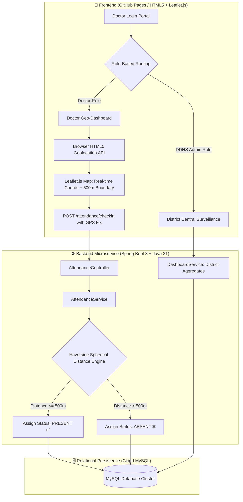
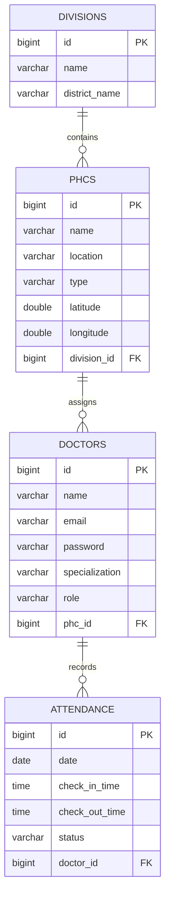

# 🏥 Primary Health Centre (PHC) Doctor Attendance & Geo-Fencing System

[](https://ranjithbrs.github.io/phc-doctor-attendance-system/)
[](https://openjdk.org/projects/jdk/21/)
[](https://spring.io/projects/spring-boot)
[](https://www.mysql.com/)
[](backend/phcbackend/Dockerfile)
[](frontend/)
[](LICENSE)

> An enterprise-grade, full-stack geo-fenced attendance monitoring web application engineered for central public health administration (DDHS) and real-time medical officer presence verification across rural Primary Health Centres (PHCs).

---

## 🌐 Live Deployment & Service Architecture

| Component | Platform | Live URL / Endpoint |
| :--- | :--- | :--- |
| **Frontend Web App** | GitHub Pages (CI/CD) | [ranjithbrs.github.io/phc-doctor-attendance-system](https://ranjithbrs.github.io/phc-doctor-attendance-system/) |
| **Backend REST API** | Render Cloud (Docker) | `https://phc-doctor-attendance-system.onrender.com` |
| **Database Tier** | Railway Cloud | Managed MySQL 8.x Instance (`phc_db`) |

---

## 📑 Table of Contents
- [System Architecture & Workflow](#-system-architecture--workflow)
- [Live Test Credentials](#-demo-test-credentials)
- [Key Features](#-key-features--capabilities)
- [Database Schema (ER Diagram)](#-database-entity-relationship-schema)
- [REST API Specifications](#-api-endpoints-summary)
- [Repository Structure](#-repository-directory-structure)
- [Local Development Setup](#-local-development-setup)
- [Deployment Guide](#-deployment)
- [Author & Connect](#-author)
- [License](#-license)

---

## 📐 System Architecture & Workflow



---

## 🔑 Demo Test Credentials

Test both role-based workflows using the following pre-seeded accounts:

### 1. 👨‍⚕️ Doctor Account
* **Email:** `doctor@phc.gov.in`
* **Password:** `doc123`
* **Workflow:** Live GPS Location tracking, visual 500m geo-fence radius map, mathematical check-in/check-out validation, and personal attendance history log.

### 2. 🏛️ Admin / DDHS Dashboard Account
* **Email:** `admin@phc.gov.in`
* **Password:** `admin123`
* **Workflow:** District-wide health surveillance overview, real-time attendance percentage breakdown per PHC, and active doctor count metrics.

*(Alternatively, select **"Create Account"** on the login page to register custom Doctor or Administrator profiles).*

---

## ✨ Key Features & Capabilities

- 📍 **Haversine Geo-Fencing Engine**: Implements the mathematical Haversine spherical formula on the server side to determine exact geodesic distance between doctor GPS coordinates and designated PHC facilities:
  $$d = 2r \arcsin\left(\sqrt{\sin^2\left(\frac{\Delta \phi}{2}\right) + \cos(\phi_1)\cos(\phi_2)\sin^2\left(\frac{\Delta \lambda}{2}\right)}\right)$$
- ⭕ **500-Meter Geo-Fence Boundary**: Automatically validates presence within a strict 500m radius; flags off-site requests as `ABSENT` with exact distance variance feedback.
- 🛑 **Check-Out Integrity Protection**: Prevents overwriting `ABSENT` records during check-out and strictly enforces check-out operations solely against valid active `PRESENT` sessions.
- 🗺️ **Interactive Leaflet.js Spatial Mapping**: Real-time rendering of the doctor's current geolocation marker against an overlaid translucent boundary circle of the medical centre.
- 🔐 **Role-Based Access Control (RBAC)**: Segregated authentication workflows and route guards for Medical Officers (`DOCTOR`) and District Health Officers (`ADMIN`).
- 📊 **Central Surveillance Analytics**: District administration view delivering aggregated PHC statistics, attendance percentages, present/absent ratios, and doctor roster tracking.
- 📅 **Filtered Historical Audit**: Searchable personal attendance logs with check-in/check-out timestamps and status tags.
- 🐳 **Docker Multi-Stage Build**: Minimized production container image powered by `eclipse-temurin:21-jre-jammy` for rapid deployments.

---

## 🗄️ Database Entity Relationship Schema



---

## 🔌 API Endpoints Summary

### Authentication Routes (`/auth`)
| Method | Endpoint | Description | Payload |
| :--- | :--- | :--- | :--- |
| `POST` | `/auth/login` | Authenticates Doctor or Admin | `{ "email": "...", "password": "..." }` |
| `POST` | `/auth/register` | Registers new medical officer or administrator | `{ "name": "...", "email": "...", "password": "...", "specialization": "...", "role": "...", "phcId": 1 }` |
| `GET` | `/auth/phcs` | Retrieves registered PHCs for assignment | None |

### Attendance Routes (`/attendance`)
| Method | Endpoint | Description | Payload / Query |
| :--- | :--- | :--- | :--- |
| `POST` | `/attendance/checkin` | Submits geo-fenced check-in with GPS fix | `{ "doctorId": 1, "latitude": 11.0168, "longitude": 76.9558 }` |
| `PUT` | `/attendance/checkout` | Records check-out timestamp | `{ "doctorId": 1 }` |
| `GET` | `/attendance/status/{doctorId}` | Gets current day's check-in status | Path Param: `doctorId` |
| `GET` | `/attendance/history/{doctorId}` | Fetches historical attendance records | Query: `from=YYYY-MM-DD&to=YYYY-MM-DD` |

### District Dashboard Routes (`/dashboard`)
| Method | Endpoint | Description | Payload / Query |
| :--- | :--- | :--- | :--- |
| `GET` | `/dashboard/summary/{divisionId}` | Fetches division KPI summary cards | Path Param: `divisionId` |
| `GET` | `/dashboard/phc-overview/{divisionId}` | Retrieves PHC breakdown with % metrics | Path Param: `divisionId` |

---

## 📁 Repository Directory Structure

```text
phc-doctor-attendance-system/
├── index.html                      # Root entrypoint & forwarder for local testing
├── DEPLOYMENT.md                   # Full step-by-step production deployment guide
├── README.md                       # Comprehensive project documentation
├── .github/
│   └── workflows/
│       └── deploy.yml              # GitHub Actions Pages CI/CD workflow
├── frontend/
│   ├── index.html                  # Sign-in portal
│   ├── register.html               # Registration view
│   ├── docDashboard.html           # Doctor interactive geo-dashboard & map
│   ├── ddhcDashboard.html          # DDHS Admin surveillance dashboard
│   ├── attendanceHistory.html      # Filterable attendance logs
│   ├── style.css                   # Global responsive design stylesheet
│   └── config.js                   # Dynamic environment API endpoint resolver
└── backend/
    ├── README.md                   # Backend architectural documentation
    └── phcbackend/
        ├── Dockerfile              # Multi-stage production container build
        ├── pom.xml                 # Maven configuration & Java 21 dependencies
        └── src/
            ├── main/java/com/ranjith/phcbackend/
            │   ├── controller/     # REST Controllers (Auth, Attendance, Dashboard)
            │   ├── model/          # JPA Entities (Division, PHC, Doctor, Attendance)
            │   ├── repository/     # Spring Data JPA Repository interfaces
            │   └── service/        # Haversine distance engine & business services
            └── main/resources/
                ├── application.properties
                └── data.sql        # Seed data script
```

---

## 🚀 Local Development Setup

### Prerequisites
- **JDK 21** or later installed
- **Apache Maven 3.8+** (or use included `./mvnw`)
- **MySQL 8.0+**

### 1. Database Setup
```sql
CREATE DATABASE phc_db;
```

### 2. Backend Setup
```bash
cd backend/phcbackend
```

Configure your local MySQL credentials in `src/main/resources/application.properties`:
```properties
SPRING_DATASOURCE_URL=jdbc:mysql://localhost:3306/phc_db?useSSL=false&allowPublicKeyRetrieval=true
SPRING_DATASOURCE_USERNAME=root
SPRING_DATASOURCE_PASSWORD=yourpassword
```

Compile and run the Spring Boot service:
```bash
# Windows
.\mvnw.cmd spring-boot:run

# Linux / macOS
./mvnw spring-boot:run
```
The REST API will initialize at `http://localhost:8080`.

### 3. Frontend Setup
Open `frontend/index.html` directly in your browser or run a lightweight HTTP server:
```bash
npx serve frontend
```
`frontend/config.js` automatically detects `localhost` and routes API requests to `http://localhost:8080`.

---

## 🌐 Deployment

For complete, step-by-step instructions on deploying the frontend to **GitHub Pages**, containerizing the backend on **Render**, and hosting the MySQL instance on **Railway**, refer to [DEPLOYMENT.md](DEPLOYMENT.md).

---

## 👨‍💻 Author

**Ranjith B**  
🎓 *B.Tech Computer Science & Business Systems (CSBS)*  
🏛️ *Nehru Institute of Engineering and Technology, Coimbatore*  

- 💼 **LinkedIn**: [linkedin.com/in/ranjith-b-85907831a](https://linkedin.com/in/ranjith-b-85907831a)  
- 🐙 **GitHub**: [github.com/ranjithbrs](https://github.com/ranjithbrs)  
- 🌐 **Portfolio**: [ranjithbrs.github.io/portfolio](https://ranjithbrs.github.io/portfolio/)  
- 📧 **Email**: ranjithb2k06@gmail.com  

---

## 📄 License

This project is licensed under the [MIT License](LICENSE).
