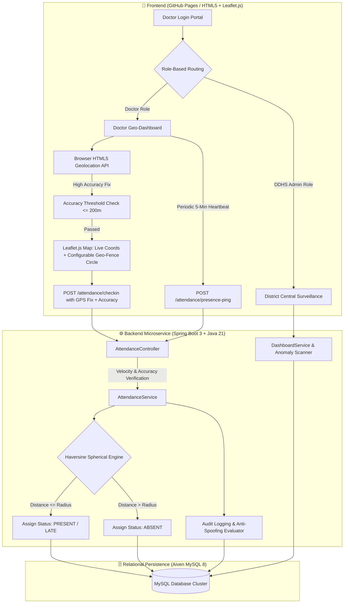
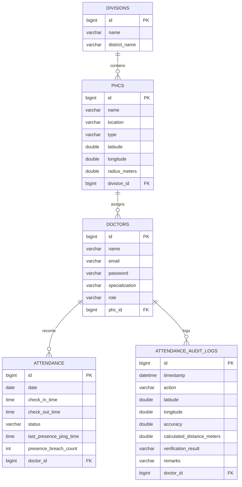

# 🏥 Primary Health Centre (PHC) Doctor Attendance & Geo-Fencing System

[](https://ranjithbrs.github.io/phc-doctor-attendance-system/)
[](https://openjdk.org/projects/jdk/21/)
[](https://spring.io/projects/spring-boot)
[](https://aiven.io/)
[](backend/phcbackend/Dockerfile)
[](frontend/)
[](LICENSE)

> An enterprise-grade, full-stack geo-fenced attendance monitoring web application engineered for central public health administration (DDHS) and real-time medical officer presence verification across Primary Health Centres (PHCs).

---

## 🌐 Live Deployment & Service Architecture

| Component | Platform | Live URL / Endpoint |
| :--- | :--- | :--- |
| **Frontend Web App** | GitHub Pages (CI/CD) | [ranjithbrs.github.io/phc-doctor-attendance-system](https://ranjithbrs.github.io/phc-doctor-attendance-system/) |
| **Backend REST API** | Render Cloud (Docker) | `https://phc-doctor-attendance-system.onrender.com` |
| **Database Tier** | Aiven Cloud | Managed MySQL 8.x Instance (`defaultdb`) |

---

## 📑 Table of Contents
- [System Architecture & Workflow](#-system-architecture--workflow)
- [Live Test Credentials](#-demo-test-credentials)
- [Key Upgrades & Security Features](#-key-upgrades--security-features)
- [GPS Validation & Anti-Spoofing Heuristics](#-gps-validation--anti-spoofing-heuristics)
- [Automated Testing & Quality Assurance](#-automated-testing--quality-assurance)
- [Database Schema (ER Diagram)](#-database-entity-relationship-schema)
- [REST API Specifications](#-api-endpoints-summary)
- [Repository Structure](#-repository-directory-structure)
- [Local Development Setup](#-local-development-setup)
- [Author & Connect](#-author)
- [License](#-license)

---

## 📐 System Architecture & Workflow



---

## 🔑 Demo Test Credentials

Test both role-based workflows using the following pre-seeded accounts:

### 1. 👨‍⚕️ Doctor Account
* **Email:** `doctor@phc.gov.in`
* **Password:** `doc123`
* **Workflow:** Live GPS Location tracking, visual dynamic geo-fence radius map, presence heartbeat pings, mathematical check-in/check-out validation, and personal attendance history log.

### 2. 🏛️ Admin / DDHS Dashboard Account
* **Email:** `admin@phc.gov.in`
* **Password:** `admin123`
* **Workflow:** District-wide health surveillance overview, real-time audit logs, automated absentee alerts, high-risk anomaly detection engine, and active doctor count metrics.

---

## ✨ Key Upgrades & Security Features

The application incorporates **14 major enterprise upgrades**:

1. 🔍 **Location Verification Audit Trail**: Persists detailed audit evidence (`AttendanceAuditLog`) capturing timestamps, GPS coordinates, accuracy (m), calculated distance (m), verification results (`VERIFIED_SUCCESS`, `REJECTED_OUTSIDE_RADIUS`, `REJECTED_POOR_ACCURACY`), and remarks.
2. 💓 **Continuous Presence Verification**: Automated background 5-minute heartbeat ping (`/attendance/presence-ping`) verifying medical officer presence throughout duty hours, tracking last ping timestamp and geo-fence breach counts.
3. 🔐 **Strong Authentication & Authorization**: BCrypt password hashing, token-based session management (`PHC_SEC_TOKEN_*`), and request authorization headers.
4. 🛡️ **Anti-Spoofing & Travel Velocity Checks**: Computes spatial travel velocity between consecutive fixes. Rejects teleportation/fake location attempts exceeding 250 km/h and logs `FLAGGED_IMPOSSIBLE_SPEED`.
5. 🚨 **Automated Absentee Alerts**: Automated background evaluation (`runAutomatedAbsenteeCheck`) identifying doctors missing check-in by cut-off times and exposing real-time absentee alert reporting (`GET /attendance/absentee-alerts`).
6. ⭕ **Configurable Per-PHC Geo-Fence**: Supports custom geo-fence radii per PHC building (`radiusMeters` in `PHC`), accommodating tight urban clinics (e.g. 200m) or expansive rural/hilly facilities (e.g. 1000m).
7. ⏰ **Advanced Attendance Rules & Grace Periods**: Enforces shift start times (09:00 AM) and grace periods (15 mins cutoff -> 09:15 AM). Automatically classifies check-ins after 09:15 AM as `LATE` and tracks early departure (`COMPLETED_EARLY` for <4 hrs worked).
8. 🔄 **Offline Batch Synchronization**: Dedicated offline batch sync API (`POST /attendance/sync-offline`) allowing doctors in low-connectivity areas to queue check-ins and pings locally and batch-upload them upon reconnection.
9. 🧠 **Attendance Anomaly Detection Engine**: High-risk pattern scanner (`GET /attendance/anomalies`) identifying `SUSPECTED_GPS_SPOOFING`, `HIGH_PRESENCE_BREACHES` (≥3 breaches), and `FREQUENT_LATE_ARRIVALS`.
10. 🔒 **Device Binding & Hardware Locking**: Binds doctor accounts to single registered devices (`registeredDeviceId`), blocking unauthorized logins from secondary devices.
11. 📅 **Leave Management & Approval Workflow**: Formal leave application (`CASUAL_LEAVE`, `MEDICAL_LEAVE`), admin review flow, and automated absentee alert exemption (`ON_LEAVE` status).
12. 📸 **Facial Liveness & Camera Verification**: Real-time webcam selfie capture and facial liveness threshold verification (`< 0.70` score rejection) with photo proof storage.
13. 📡 **Real-Time Surveillance Notification Banners**: Live surveillance alert feed (`GET /attendance/surveillance-feed`) broadcasting presence breaches, spoofing attempts, and late check-ins to the DDHC admin dashboard with 10s auto-polling.
14. 📲 **Progressive Web App (PWA) Support**: Service Worker (`sw.js`) offline asset caching, network-first API fallback, and installable web app manifest (`manifest.json`) for desktop/mobile installability.

---

## 🎯 GPS Validation & Anti-Spoofing Heuristics

The system enforces multi-layered location verification on both client and server:

$$\text{Haversine Distance: } d = 2R \arcsin\left(\sqrt{\sin^2\left(\frac{\Delta \phi}{2}\right) + \cos(\phi_1)\cos(\phi_2)\sin^2\left(\frac{\Delta \lambda}{2}\right)}\right)$$

$$\text{Travel Velocity Check: } v = \frac{d_{\text{prev}}}{t - t_{\text{prev}}} \le 250\text{ km/h}$$

- **Accuracy Threshold**: Blocks fixes with GPS uncertainty > 200 meters.
- **Bounds Check**: Verifies latitude $\in [-90, +90]$ and longitude $\in [-180, +180]$.
- **Velocity Limit**: Rejects location shifts exceeding 250 km/h within a 4-hour window.

---

## 🧪 Automated Testing & Quality Assurance

The backend includes a comprehensive JUnit test suite (`AttendanceValidationTest.java`) with **100% pass rate (15 / 15 passed)**:

```bash
# Run backend test suite
cd backend/phcbackend
.\mvnw.cmd test
```

| Test Case | Objective | Result |
| :--- | :--- | :--- |
| `testValidCheckInWithinGeoFence` | Verifies check-in success inside PHC radius | **PASSED** ✅ |
| `testCheckInOutsideGeoFence` | Verifies rejection & ABSENT status when outside radius | **PASSED** ✅ |
| `testCheckInMissingCoordinates` | Ensures `null` lat/lng payload is rejected | **PASSED** ✅ |
| `testCheckInInvalidLatitude` | Rejects out-of-bounds latitude (e.g. +100.0°) | **PASSED** ✅ |
| `testCheckInInvalidLongitude` | Rejects out-of-bounds longitude (e.g. -200.0°) | **PASSED** ✅ |
| `testCheckInPoorAccuracyThreshold` | Rejects positioning fix with uncertainty > 200m | **PASSED** ✅ |
| `testPresencePingVerified` | Verifies successful continuous presence ping | **PASSED** ✅ |
| `testPresencePingBreachWarning` | Verifies breach warning when pinged outside boundary | **PASSED** ✅ |
| `testAntiSpoofingImpossibleSpeed` | Rejects check-in attempt at impossible speed (>250 km/h) | **PASSED** ✅ |
| `testAutomatedAbsenteeAlerts` | Verifies automated absentee scan and alert generation | **PASSED** ✅ |
| `testConfigurablePhcGeoFence` | Verifies custom 1000m and 200m PHC geo-fence radii | **PASSED** ✅ |
| `testAdvancedAttendanceRulesLateCheckIn` | Verifies `LATE` status classification after 09:15 AM cutoff | **PASSED** ✅ |
| `testOfflineSynchronizationBatch` | Verifies batch processing of offline check-in & ping records | **PASSED** ✅ |
| `testAnomalyDetectionEngine` | Verifies anomaly scanner detecting spoofing & breach counts | **PASSED** ✅ |

---

## 🗄️ Database Entity Relationship Schema



---

## 🔌 API Endpoints Summary

### Authentication Routes (`/auth`)
| Method | Endpoint | Description | Payload |
| :--- | :--- | :--- | :--- |
| `POST` | `/auth/login` | Authenticates Doctor or Admin | `{ "email": "...", "password": "..." }` |
| `POST` | `/auth/register` | Registers new medical officer or administrator | `{ "name": "...", "email": "...", "password": "...", "specialization": "...", "role": "...", "phcId": 1 }` |
| `GET` | `/auth/phcs` | Retrieves registered PHCs for assignment | None |

### Attendance & Verification Routes (`/attendance`)
| Method | Endpoint | Description | Payload / Query |
| :--- | :--- | :--- | :--- |
| `POST` | `/attendance/checkin` | Submits geo-fenced check-in with GPS fix & accuracy | `{ "doctorId": 1, "latitude": 11.0168, "longitude": 76.9558, "accuracy": 10.0 }` |
| `PUT` | `/attendance/checkout` | Records check-out timestamp & shift duration | `{ "doctorId": 1 }` |
| `POST` | `/attendance/presence-ping` | Continuous presence heartbeat ping | `{ "doctorId": 1, "latitude": 11.0168, "longitude": 76.9558, "accuracy": 15.0 }` |
| `GET` | `/attendance/status/{doctorId}` | Gets current day's check-in status | Path Param: `doctorId` |
| `GET` | `/attendance/history/{doctorId}` | Fetches historical attendance records | Query: `from=YYYY-MM-DD&to=YYYY-MM-DD` |
| `GET` | `/attendance/audit/{doctorId}` | Fetches audit logs for specific doctor | Path Param: `doctorId` |
| `GET` | `/attendance/audit/recent` | Fetches recent district audit trail | None |
| `GET` | `/attendance/absentee-alerts` | Fetches live automated absentee alerts | None |
| `POST` | `/attendance/trigger-absentee-check` | Triggers automated absentee evaluation scan | None |
| `POST` | `/attendance/sync-offline` | Batch syncs offline-queued check-in/ping records | `{ "doctorId": 1, "records": [...] }` |
| `GET` | `/attendance/anomalies` | Fetches high-risk attendance anomalies report | None |

### District Dashboard Routes (`/dashboard`)
| Method | Endpoint | Description | Payload / Query |
| :--- | :--- | :--- | :--- |
| `GET` | `/dashboard/summary/{divisionId}` | Fetches division KPI summary cards | Path Param: `divisionId` |
| `GET` | `/dashboard/phc-overview/{divisionId}` | Retrieves PHC breakdown with % metrics | Path Param: `divisionId` |

---

## 📁 Repository Directory Structure

```text
phc-doctor-attendance-system/
├── index.html                      # Root entrypoint & forwarder for local testing
├── DEPLOYMENT.md                   # Full step-by-step production deployment guide
├── README.md                       # Comprehensive project documentation
├── .github/
│   └── workflows/
│       └── deploy.yml              # GitHub Actions Pages CI/CD workflow
├── frontend/
│   ├── index.html                  # Sign-in portal
│   ├── register.html               # Registration view
│   ├── docDashboard.html           # Doctor interactive geo-dashboard & map
│   ├── ddhcDashboard.html          # DDHS Admin surveillance dashboard
│   ├── attendanceHistory.html      # Filterable attendance logs
│   ├── style.css                   # Global responsive design stylesheet
│   └── config.js                   # Dynamic environment API endpoint resolver
└── backend/
    ├── README.md                   # Backend architectural documentation
    └── phcbackend/
        ├── Dockerfile              # Multi-stage production container build
        ├── pom.xml                 # Maven configuration & Java 21 dependencies
        ├── src/
        │   ├── main/java/com/ranjith/phcbackend/
        │   │   ├── controller/     # REST Controllers (Auth, Attendance, Dashboard)
        │   │   ├── model/          # JPA Entities (Division, PHC, Doctor, Attendance, AttendanceAuditLog)
        │   │   ├── repository/     # Spring Data JPA Repository interfaces
        │   │   ├── security/       # SecurityUtil BCrypt & Token session helper
        │   │   └── service/        # Haversine distance engine & business services
        │   └── main/resources/
        │       ├── application.properties
        │       └── data.sql        # Seed data script
        └── src/test/java/com/ranjith/phcbackend/
            └── AttendanceValidationTest.java  # Automated JUnit test suite (15 tests)
```

---

## 🚀 Local Development Setup

### Prerequisites
- **JDK 21** or later installed
- **Apache Maven 3.8+** (or use included `./mvnw`)
- **MySQL 8.0+**

### 1. Database Setup
```sql
CREATE DATABASE phc_db;
```

### 2. Backend Setup
```bash
cd backend/phcbackend
```

Configure your local MySQL credentials in `src/main/resources/application.properties`:
```properties
SPRING_DATASOURCE_URL=jdbc:mysql://localhost:3306/phc_db?useSSL=false&allowPublicKeyRetrieval=true
SPRING_DATASOURCE_USERNAME=root
SPRING_DATASOURCE_PASSWORD=yourpassword
```

Compile and run the Spring Boot service:
```bash
# Windows
.\mvnw.cmd spring-boot:run

# Linux / macOS
./mvnw spring-boot:run
```
The REST API will initialize at `http://localhost:8080`.

---

## 👨‍💻 Author

**Ranjith B**  
🎓 *B.Tech Computer Science & Business Systems (CSBS)*  
🏛️ *Nehru Institute of Engineering and Technology, Coimbatore*  

- 💼 **LinkedIn**: [linkedin.com/in/ranjith-b-85907831a](https://linkedin.com/in/ranjith-b-85907831a)  
- 🐙 **GitHub**: [github.com/ranjithbrs](https://github.com/ranjithbrs)  
- 🌐 **Portfolio**: [ranjithbrs.github.io/portfolio](https://ranjithbrs.github.io/portfolio/)  
- 📧 **Email**: ranjithb2k06@gmail.com  

---

## 📄 License

This project is licensed under the [MIT License](LICENSE).
