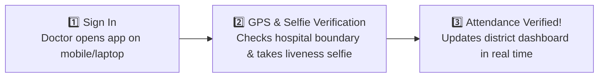

# 🏥 Primary Health Centre (PHC) Doctor Attendance & Health Surveillance System

---

## 🌟 What is this Project?

The **PHC Doctor Attendance System** is an easy-to-use smart web application created for government Primary Health Centres (PHCs). 

Instead of using paper registers (which can be easily faked or misplaced), this system allows doctors to check in using their phone's **GPS location map** and a quick **selfie verification**. District Health Officers can view live attendance, see visual charts, and download official government PDF reports with one click!

---

## ❓ Why Was This Built? (The Problem & Solution)

| ❌ The Old Way (Paper Registers) | ✅ The New Smart Way (This System) |
| :--- | :--- |
| Doctors could sign registers without being present at the hospital. | Checks doctor's exact GPS location—must be inside the hospital boundary (500m). |
| Hard for health officials to track daily attendance across multiple rural centers. | Live central dashboard shows attendance across all health centers in real time. |
| Takes hours to create attendance reports. | Download official formatted PDF / CSV reports instantly. |

---

## 🚀 Try It Live (Demo Accounts)

You can try the live application right now in your web browser:

👉 **[Click Here to Open Live Application](https://ranjithbrs.github.io/phc-doctor-attendance-system/)**

Use these pre-configured test accounts to sign in:

| Role | Email | Password | What You Can Do |
| :--- | :--- | :--- | :--- |
| 👨‍⚕️ **Doctor Portal** | `doctor@phc.gov.in` | `doc123` | View live GPS map, mark attendance with selfie, view past history, apply for leave. |
| 🏛️ **District Admin** | `admin@phc.gov.in` | `admin123` | View district surveillance map, inspect weekly trend charts, download PDF reports, send emergency alerts. |

---

## 💡 How It Works (Simple 3-Step Process)

```mermaid
flowchart LR
    Step1["1️⃣ Sign In<br>Doctor opens app on mobile/laptop"] --> Step2["2️⃣ GPS & Selfie Verification<br>Checks hospital boundary & takes liveness selfie"]
    Step2 --> Step3["3️⃣ Attendance Verified!<br>Updates district dashboard in real time"]
```

1. **Step 1: Sign In** — Doctor logs into their account from their phone or computer.
2. **Step 2: Location & Selfie Check** — The app checks if the doctor is physically within 500 meters of their assigned Health Centre and takes a quick camera selfie.
3. **Step 3: Verified Attendance** — Once location and selfie are verified, attendance is logged and updated on the district administration dashboard instantly.

---

## ✨ Main Features Made Simple

- 📍 **Smart GPS Geofencing**: Ensures doctors are physically at the hospital before allowing check-in.
- 📸 **Camera Selfie Verification**: Prevents proxy attendance (no one else can mark attendance for you).
- 📊 **Visual Analytics Charts**: Simple graphs showing weekly attendance trends and hospital comparisons.
- 📄 **1-Click PDF & Excel Reports**: Health officers can download official formatted reports with one click.
- 📅 **Leave Management**: Doctors can apply for leave online; admins can approve or reject in seconds.
- 🚨 **Emergency SOS Mode**: District officers can broadcast emergency outbreak alerts to all doctor portals.
- 📱 **Works Offline**: If internet connectivity is weak in rural areas, check-ins save automatically and sync when reconnected.

---

## 🛠️ Technology Behind the Project (For Tech Enthusiasts)

For developers and technical evaluators, here is a quick overview of the tech stack:

- **Frontend**: HTML5, CSS3, JavaScript (ES6+), Leaflet.js (Maps), Chart.js (Graphs), jsPDF (PDF Generator), Service Workers (PWA Offline Sync).
- **Backend**: Java 21, Spring Boot 3, Spring Data JPA, RESTful APIs.
- **Security**: BCrypt password hashing, Device Binding Hardware Lock, Token Session Management.
- **Database**: MySQL 8 / H2 Database.
- **Deployment**: GitHub Pages (Frontend) + Render Cloud Container (Backend).

---

## 📑 Complete Academic Project Documentation

If you are a college examiner or reviewer looking for full architectural diagrams:
- 📄 **[Full Academic Project Report & Diagrams (ERD, DFD, UML)](ACADEMIC_PROJECT_REPORT.md)**

---

## 👨‍💻 Author & Contact

**Ranjith B**  
🎓 *B.Tech Computer Science & Business Systems (CSBS)*  
🏛️ *Nehru Institute of Engineering and Technology, Coimbatore*  

- 💼 **LinkedIn**: [linkedin.com/in/ranjith-b-csbs](https://linkedin.com/in/ranjith-b-csbs)  
- 🐙 **GitHub**: [github.com/ranjithbrs](https://github.com/ranjithbrs)  
- 🌐 **Portfolio**: [ranjithbrs.github.io/portfolio](https://ranjithbrs.github.io/portfolio/)  
- 📧 **Email**: ranjithb2k06@gmail.com  

---

## 📄 License

This project is open-source and available under the [MIT License](LICENSE).
